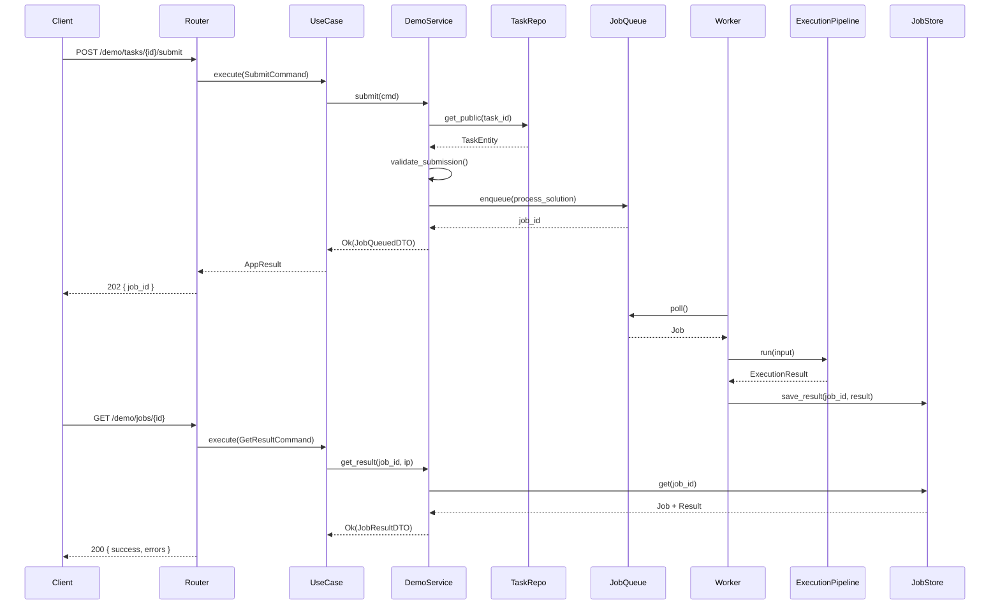

# Code Trainer Backend — конвенции разработки

Документ фиксирует архитектуру, структуру репозитория, стиль кода и правила добавления нового функционала.

Основа — **feature-first modular monolith** (по образцу `diplom/backend`), адаптированный под Code Trainer и доработанный в местах, где diplom накапливает технический долг.

---

## 1. Принципы

### 1.1. Продукт

Code Trainer — платформа **сравнения языков программирования**: пользователь знает язык-источник и учит целевой, решая практические задания. Проверяется не только корректность результата, но и **использование ожидаемых конструкций** (for, while, class и т.д.).

### 1.2. Архитектурные принципы

| # | Принцип | Смысл |
|---|---------|-------|
| 1 | **Feature-first** | Код группируется по бизнес-возможностям (`features/`), а не по техническим слоям глобально |
| 2 | **Слои внутри фичи** | В каждой фиче — свой router → use case → service → domain/repo |
| 3 | **Async end-to-end** | FastAPI, SQLAlchemy 2 async, asyncpg; I/O не блокирует event loop |
| 4 | **Явные use cases** | Одна операция = один use case + command; без «бог-роутеров» |
| 5 | **Ожидаемые ошибки — через Result** | `AppResult[T]` вместо исключений для бизнес-ошибок |
| 6 | **Неожиданные ошибки — через handlers** | Глобальные exception handlers; `str(exc)` наружу не отдаём |
| 7 | **Тестируемость с первого дня** | Unit без БД/Docker; integration с БД; e2e по фичам |
| 8 | **Минимум связности** | Фича не импортирует внутренности другой фичи; только публичные контракты |
| 9 | **Инфраструктура — за портами** | Docker, Redis, AST — за интерфейсами в `core/interfaces/` |
| 10 | **Один способ делать вещи** | Один DI, один формат ошибок, один шаблон фичи |

### 1.3. Чего избегаем (уроки старого Code Trainer)

- Глобальные слои `api/ → application/ → domain/ → infrastructure/` без привязки к фиче
- Три разных способа DI в одном проекте (container + ручные фабрики + module-level singletons)
- `except ValueError` / `except Exception` в роутерах и сервисах
- Декоративные use cases, которые только проксируют один вызов
- Дублирование кода в `src/` и `backend/` в одном репозитории
- Integration-тесты с битыми импортами и без изоляции

---

## 2. Структура репозитория

```
backend/
├── CONVENTIONS.md
├── README.md
├── pyproject.toml
├── alembic.ini
├── Makefile
├── .env.example
│
├── migrations/             # Alembic (вне src)
├── docker/
├── tests/
│   ├── conftest.py
│   ├── unit/
│   │   ├── catalog/
│   │   ├── demo/
│   │   ├── execution/
│   │   ├── languages/
│   │   └── tasks/
│   ├── integration/
│   ├── e2e/                # зеркалит features/
│   │   ├── catalog/
│   │   ├── demo/
│   │   ├── health/
│   │   └── languages/
│   ├── helpers/
│   ├── fixtures/
│   └── fakes/
│
└── src/
    ├── cli.py
    ├── core/
    │   ├── either/
    │   ├── interfaces/
    │   ├── logger/
    │   └── containers/
    ├── features/
    │   ├── health/
    │   │   └── services/
    │   ├── languages/
    │   │   ├── domain/
    │   │   ├── repos/
    │   │   └── services/
    │   ├── catalog/
    │   │   ├── domain/
    │   │   ├── repos/
    │   │   └── services/
    │   ├── tasks/            # домен заданий, без router
    │   │   ├── domain/
    │   │   │   └── entities/
    │   │   ├── repos/
    │   │   └── services/
    │   └── demo/
    │       ├── domain/
    │       └── services/
    ├── shared/
    │   ├── database/
    │   ├── domain/
    │   ├── handlers/
    │   └── execution/
    └── workers/
```

**Исходный код — только в `src/`.** Тесты — в `tests/` на том же уровне, что и `src/`.

Файлы `router.py`, `schemas.py`, `commands.py`, `usecases.py`, `models.py`, `mappers.py` создаются при реализации фичи по шаблону §4 — в дереве каталогов не дублируются.

---

## 3. Слои и зоны ответственности

### 3.1. `src/core/` — ядро

Не содержит бизнес-логики продукта.

```
core/
├── settings.py             # pydantic-settings, группы DB__, REDIS__, EXECUTION__
├── rest.py                 # create_app(), exception handlers, подключение роутеров
├── either/
│   ├── result.py           # AppResult[T], Ok, Err
│   └── failures.py         # Failure, NotFoundFailure, ValidationFailure…
├── interfaces/             # порты: UnitOfWork, CodeRunner, JobQueue, Clock…
├── logger/
└── containers/             # DI: один файл на зону, не god file
    ├── __init__.py         # class Container — корень
    ├── db.py
    └── {feature}.py        # под-контейнер фичи
```

### 3.2. `src/features/` — бизнес-возможности

Каждая папка — **bounded context** с HTTP-эндпоинтами или чисто доменный модуль (без router).

**Текущий план фич (MVP и далее):**

| Фича | Router | Назначение |
|------|--------|------------|
| `health` | да | liveness / readiness |
| `languages` | да | языки, пары source → target |
| `catalog` | да | темы, коллекции, список и детали заданий |
| `tasks` | **нет** | домен заданий (translation, block_reorder, flowchart) |
| `demo` | да | решение без регистрации, все типы заданий |
| `submissions` | позже | отправка с сохранением (после auth) |
| `auth` | позже | регистрация, вход |
| `progress` | позже | статусы, попытки, рекомендации |
| `groups` | позже | преподаватель, группы, наборы |

### 3.3. `src/shared/` — общая инфраструктура

Код, который используют **несколько фич**, но не относится к одной бизнес-области.

```
shared/
├── database/               # SqlAlchemy engine, session, UnitOfWork
├── domain/                 # общие VO, базовые exceptions
├── handlers/               # auth_handlers, http_handlers (unwrap_ok_or_http_exc)
└── execution/              # проверка и запуск кода (не HTTP-фича)
    ├── pipeline.py         # compile → structure → tests
    ├── docker_runner.py
    ├── structure_checker.py
    ├── flow_validator.py
    └── block_order_validator.py
```

**Правило:** если у модуля нет своих HTTP-эндпоинтов и он обслуживает несколько фич — он в `shared/`, не в `features/`.

### 3.4. `src/workers/` — фоновые процессы

Отдельные entry points (не FastAPI): очередь, Docker execution, тяжёлые проверки.

```
workers/
├── bootstrap.py            # сборка Container без FastAPI wiring
└── execution_worker.py
```

Конкретная технология очереди (Redis / Celery) — решение реализации; структура не привязана к ней.

---

## 4. Шаблон фичи

### 4.1. Фича с HTTP (стандарт)

```
features/{feature_name}/
├── router.py               # FastAPI routes
├── schemas.py              # request/response Pydantic models
├── commands.py             # input dataclasses для use cases
├── usecases.py             # use case classes (или usecases/ при >300 строк)
├── services/
│   └── {feature}_service.py
├── domain/                 # опционально, если есть богатая модель
│   ├── entities/
│   ├── enums.py
│   ├── dto.py
│   └── failures.py         # feature-specific Failure types
├── repos/
│   ├── {entity}_repo.py    # ABC
│   └── sqlalchemy_{entity}_repo.py
├── models.py               # SQLAlchemy ORM
├── mappers.py              # ORM ↔ domain entity
└── dependencies.py         # опционально: FastAPI Depends-обёртки
```

### 4.2. Доменная фича без HTTP (например, `tasks`)

Тот же шаблон, **без** `router.py`, `schemas.py`, `commands.py` на верхнем уровне API. Публичный контракт — сервисы и репозитории, которые вызывают `catalog`, `demo`, `submissions`.

### 4.3. Минимальная фича (например, `health`)

Допустимо только `router.py`, `schemas.py`, `services/` — если нет персистентности и домена.

### 4.4. Когда выносить в `usecases/`

Один `usecases.py` — пока файл **< 300 строк**. Иначе пакет:

```
usecases/
├── submit_demo_solution.py
└── get_demo_result.py
```

---

## 5. Поток данных

### 5.1. Общая схема слоёв

```
HTTP Request
    → router.py              # schemas, auth deps, DI
    → use case.execute(cmd)  # граница транзакции, оркестрация
    → service                # бизнес-логика, AppResult
    → entity / repo          # домен и персистентность
    → unwrap_ok_or_http_exc  # router: Result → response или HTTP error
```

**Роутер** — без бизнес-логики: принять запрос, вызвать use case, вернуть ответ.

**Use case** — без SQL: UoW, вызов сервисов, commit/rollback.

**Service** — без FastAPI: возвращает `AppResult[T]`.

Тяжёлая работа (Docker, AST) **не в API** — только через очередь и `workers/`.

---

### 5.2. Синхронное чтение

**Пример:** `GET /api/catalog/tasks/{id}`

```
Client
  → catalog/router.py
  → GetTaskByIdUseCase.execute(GetTaskByIdCommand)
  → CatalogService.get_task(task_id)
  → TaskRepo.get_by_id()          # features/tasks/repos/
  → mapper: TaskModel → TaskEntity → TaskDetailDTO
  → AppResult[TaskDetailDTO]
  → unwrap_ok_or_http_exc
  → 200 + TaskDetailResponse
```

| Слой | Знает о | Не знает о |
|------|---------|------------|
| Router | schemas, use case | SQL, бизнес-правила |
| Use case | UoW, service | FastAPI, SQL |
| Service | repo, entity, failures | HTTP, session напрямую |
| Repo | ORM, mapper | HTTP, AppResult |
| Entity | инварианты домена | БД, API |

**Поток типов:**

```
path param (int)
  → Command:  GetTaskByIdCommand(task_id=42)
  → Repo:     TaskRepo.get_by_id(42) → TaskEntity | None
  → Service:  TaskEntity → TaskDetailDTO
  → Result:   AppResult[TaskDetailDTO]
  → Schema:   TaskDetailResponse
  → JSON
```

---

### 5.3. Асинхронная проверка (основной паттерн)

**Пример:** demo-режим — `POST /api/demo/tasks/{id}/submit` + `GET /api/demo/jobs/{job_id}`

Используется для translation, block_reorder, flowchart. API быстро принимает заявку; проверка — в worker.

#### Фаза 1 — принятие (API)

```
Client  POST /api/demo/tasks/{id}/submit
  → demo/router.py
      • SubmitDemoSolutionSchema → SubmitDemoSolutionCommand
      • client_ip из Request
  → SubmitDemoSolutionUseCase.execute(cmd)
      async with uow(autocommit=True):
          return await demo_service.submit(cmd)
  → DemoService.submit(cmd) → AppResult[JobQueuedDTO]
      1. task = task_repo.get_public(cmd.task_id)
         → None ⇒ Err(NotFoundFailure)
      2. rate_limiter.check(cmd.client_ip)
         → exceeded ⇒ Err(RateLimitFailure)
      3. task.validate_submission(cmd.payload)    # домен features/tasks
         → invalid ⇒ Err(ValidationFailure)
      4. job_queue.enqueue(
             op="process_solution",
             input=ExecutionInput(task, payload),
             metadata={ client_ip, persist: false },
         )
         → queue down ⇒ Err(InfrastructureFailure)
      5. Ok(JobQueuedDTO(job_id, status="queued"))
  → router → 202 { job_id, status }
```

#### Фаза 2 — worker (отдельный процесс)

```
workers/execution_worker.py
  → job = job_queue.poll()
  → shared/execution/pipeline.run(job.input)
      1. ветвление по task.family (translation | block_reorder | flowchart)
      2. compile (docker_runner) — если нужен код
      3. structure_checker — ожидаемые конструкции
      4. flow_validator / block_order_validator — по типу
      5. test_cases — если есть
      → ExecutionResult { success, errors[] }
  → job_store.save_result(job_id, result)
```

Worker **не поднимает FastAPI**, **не возвращает HTTP**.

#### Фаза 3 — polling (API)

```
Client  GET /api/demo/jobs/{job_id}
  → GetDemoJobResultUseCase.execute(cmd)
  → DemoService.get_result(job_id, client_ip)
      1. job = job_store.get(job_id) → None ⇒ Err(NotFoundFailure)
      2. job.client_ip != cmd.client_ip ⇒ Err(AccessDeniedFailure)
      3. terminal? → JobResultDTO : JobStatusDTO (still running)
  → router → 200 JSON
```

#### Sequence (полный путь)



---

### 5.4. Типы данных на границах

| Тип | Где | Назначение |
|-----|-----|------------|
| `*Schema` | `features/*/schemas.py` | HTTP request/response (Pydantic) |
| `*Command` | `features/*/commands.py` | вход use case |
| `*Entity` | `features/*/domain/entities/` | доменные инварианты |
| `*Model` | `features/*/models.py` | SQLAlchemy ORM |
| `*DTO` | `features/*/domain/dto.py` | выход service → use case → API |
| `ExecutionInput` | `shared/execution/types.py` | payload очереди |
| `ExecutionResult` | `shared/execution/types.py` | результат pipeline |

**Правило:** один объект на всё — запрещено. Маппинг явный на каждой границе.

---

### 5.5. Ошибки на пути

| Место | Ситуация | Механизм | HTTP |
|-------|----------|----------|------|
| FastAPI | невалидный body | `RequestValidationError` | 422 |
| Service | задание не найдено / не public | `Err(NotFoundFailure)` | 404 |
| Service | rate limit | `Err(RateLimitFailure)` | 429 |
| Service | неверное решение (формат) | `Err(ValidationFailure)` | 422 |
| Service | очередь недоступна | `Err(InfrastructureFailure)` | 503 |
| Service | чужой job_id | `Err(AccessDeniedFailure)` | 403 |
| Worker | сбой pipeline | job `failed`, лог traceback | — |
| Любой | необработанный баг | global handler | 500 (без `str(exc)`) |

---

### 5.6. DI на пути

```
Container
├── db.uow                         → UseCase
├── tasks.task_repo                → CatalogService, DemoService, Pipeline
├── demo.demo_service_factory      → UseCase
├── shared.job_queue               → DemoService, Worker
└── shared.execution_pipeline      → Worker

Router:  Depends(Provide[Container.demo.submit_usecase])
Worker:  container = Container() в bootstrap.py, без FastAPI wiring
```

---

### 5.7. Режимы persistence

Один pipeline, разница в `metadata.persist`:

| Режим | `persist` | После pipeline |
|-------|-----------|----------------|
| Demo | `false` | только job store (TTL) |
| Submission (позже) | `true` | + запись в БД, progress |

Ветвление — в service после получения `ExecutionResult`, не в pipeline.

---

### 5.8. Чеклист: что не должно происходить

- Router вызывает `ExecutionPipeline` или Docker напрямую
- Router выполняет SQL
- Service возвращает `HTTPException`
- Worker поднимает FastAPI
- `shared/execution` импортирует `features/demo/services/`
- Бизнес-правила продукта (ветвление по языку/типу задания) — в `shared/` (только в `features/tasks` и service фичи)
- Docker запускается из async route (только worker)

---

## 6. Обработка ошибок

### 6.1. Три уровня

| Уровень | Тип | Когда |
|---------|-----|-------|
| Ожидаемая бизнес-ошибка | `AppResult` + `Failure` | не найдено, нет доступа, неверные блоки, rate limit |
| Ошибка валидации входа | `RequestValidationError` → 422 | Pydantic / FastAPI |
| Неожиданная ошибка | `Exception` → 500 | баг; в лог — полный traceback, клиенту — generic message |

### 6.2. Формат ответа об ошибке

```json
{
  "error": {
    "code": "NOT_FOUND",
    "message": "Task with id 42 not found",
    "details": null
  }
}
```

### 6.3. Правила

- В **router** — `unwrap_ok_or_http_exc(result)`; не `try/except ValueError`
- В **service** — `return Err(SomeFailure(...))`; не `raise HTTPException`
- В **domain** — инварианты через исключения домена или `Failure`; не HTTP
- **Запрещено** отдавать `str(exception)` клиенту на 500
- Feature-specific failures — в `features/{name}/domain/failures.py` или `failures.py`

---

## 7. Dependency Injection

### 7.1. Библиотека

`dependency-injector`, wiring через `Provide[Container.{zone}.{provider}]`.

### 7.2. Структура контейнеров

```python
# core/containers/__init__.py
class Container(containers.DeclarativeContainer):
    config = providers.Singleton(AppSettings)
    db = providers.Container(DBContainer, config=config)
    catalog = providers.Container(CatalogContainer, db=db)
    demo = providers.Container(DemoContainer, db=db, ...)
```

**Запрещено** складывать все провайдеры в один файл > 500 строк.

### 7.3. Паттерн use case

```python
@dataclass
class SubmitDemoSolutionUseCase:
    uow: UnitOfWork
    demo_service_factory: Callable[..., DemoService]

    @property
    def demo_service(self) -> DemoService:
        return self.demo_service_factory(uow=self.uow)

    async def execute(self, cmd: SubmitDemoSolutionCommand) -> AppResult[JobQueuedDTO]:
        async with self.uow(autocommit=True):
            return await self.demo_service.submit(cmd)
```

### 7.4. Запрещено

- `_*_service = SomeService()` на уровне модуля в `router.py`
- Ручная сборка use case в каждом эндпоинте без DI
- `Container()` внутри бизнес-логики (только bootstrap: app, worker, cli)

---

## 8. Unit of Work

### 8.1. Принцип

UoW управляет транзакцией. Use case открывает `async with self.uow(autocommit=...)`.

### 8.2. Доработка vs diplom

В diplom UoW знает о **всех** репозиториях — при каждой новой фиче растёт один класс.

**Здесь:** UoW предоставляет session; репозитории получают session через factory/DI. Либо UoW с **lazy properties** по зонам, но без импорта всех фич в одном файле.

### 8.3. Правило

Новая фича добавляет **свой** repo в свой под-контейнер. Не правит монолитный файл на 40 репозиториев.

---

## 9. Именование

### 9.1. Файлы и папки

| Что | Конвенция | Пример |
|-----|-----------|--------|
| Фича | `snake_case`, мн.ч. где уместно | `languages`, `catalog`, `tasks` |
| Router | `router.py` | — |
| Use case class | `{Verb}{Noun}UseCase` | `SubmitDemoSolutionUseCase` |
| Command | `{Verb}{Noun}Command` | `SubmitDemoSolutionCommand` |
| Service | `{Feature}Service` | `CatalogService` |
| Repo ABC | `{Entity}Repo` | `TaskRepo` |
| Repo impl | `SqlAlchemy{Entity}Repo` | `SqlAlchemyTaskRepo` |
| Entity | `{Entity}Entity` или просто `{Entity}` | `TaskEntity` |
| ORM model | `{Entity}Model` или имя таблицы | `TaskModel` |
| Mapper | `{entity}_mapper.py` или `mappers.py` | — |
| Failure | `{Context}Failure` | `DemoRateLimitFailure` |

### 9.2. Импорты

Абсолютные от `src`:

```python
from src.features.catalog.services.catalog_service import CatalogService
from src.core.either import AppResult, Ok, Err
```

### 9.3. API paths

- Префикс: `/api`
- Ресурсы — множественное число: `/api/catalog/tasks`, `/api/demo/jobs/{id}`
- Версионирование — при необходимости `/api/v1/...` (вводить, когда появится v2)

---

## 10. Домен заданий (`features/tasks`)

Типы заданий — варианты одного агрегата, не отдельные фичи.

```
TaskFamily
├── TRANSLATION      # snippet | full_program
├── BLOCK_REORDER    # free | template
└── FLOWCHART        # code_from_diagram | diagram_from_code | blocks_from_diagram
```

Проверка решения зависит от family — ветвление в `shared/execution/pipeline.py`, не в роутерах.

---

## 11. Тестирование

### 11.1. Пирамида

| Слой | Путь | Зависимости |
|------|------|-------------|
| Unit | `tests/unit/{zone}/` | без БД, без Docker; моки портов |
| Integration | `tests/integration/` | реальная БД (test schema) |
| E2E | `tests/e2e/{feature}/` | HTTP через ASGI transport, test container |

### 11.2. Правила

- Каждая фича с router — хотя бы один e2e happy path
- Execution pipeline — unit-тесты на каждый checker отдельно
- Docker — только в integration/e2e с маркером `@pytest.mark.docker`
- `conftest.py` — общие фикстуры: db session, container override, frozen clock
- Builders/persisters — в `tests/helpers/`

### 11.3. Именование тестов

```python
async def test_submit_demo_solution__returns_job_id_when_task_is_public(): ...
async def test_submit_demo_solution__returns_not_found_when_task_is_private(): ...
```

Паттерн: `{метод}__{ожидание}__{условие}`.

---

## 12. Стиль кода

### 12.1. Инструменты

| Инструмент | Назначение |
|------------|------------|
| Python 3.12+ | runtime |
| ruff | lint |
| black | format |
| mypy | strict typing (`disallow_untyped_defs = true`) |
| pytest + pytest-asyncio | тесты |

### 12.2. Типизация

- Все публичные функции и методы — с аннотациями типов
- `AppResult[T]` явно в сигнатуре use case и service
- Pydantic v2 для schemas и settings

### 12.3. Docstrings

- Публичные use cases и сервисы — краткий docstring на русском или английском (единый язык на проект — **русский** для бизнес-комментариев)
- `# noqa` и `type: ignore` — только с комментарием почему

### 12.4. Размер файлов

- Мягкий лимит **300 строк** на файл; при превышении — разбивать
- Мягкий лимит **50 строк** на функцию

---

## 13. Конфигурация

- `pydantic-settings`, вложенные группы, разделитель `__`
- Примеры: `DB__HOST`, `REDIS__URL`, `EXECUTION__DOCKER_SOCKET`
- Секреты — только через env, не в коде
- `.env.example` — все переменные с описанием

---

## 14. Добавление новой фичи (чеклист)

1. Создать `src/features/{name}/` по шаблону §4
2. Добавить `core/containers/{name}.py` и подключить в корневой `Container`
3. Зарегистрировать router в `core/rest.py` (или `features/__init__.py` → `get_routers()`)
4. Добавить модели + Alembic migration
5. Написать unit-тесты сервиса
6. Написать e2e happy path
7. Обновить `README.md` (если фича user-facing)

**Перед добавлением** — убедиться, что это отдельный bounded context, а не метод существующей фичи.

---

## 15. Границы между фичами

### 15.1. Разрешено

- `catalog` импортирует `TaskRepo` из `features/tasks/repos/`
- `demo` вызывает `shared/execution/pipeline.py`
- Общие VO из `shared/domain/`

### 15.2. Запрещено

- `catalog` импортирует `features/demo/services/demo_service.py`
- Циклические импорты между фичами
- Общая бизнес-логика в `shared/` (только инфраструктура и технические pipeline)

### 15.3. Если фичи нужны друг другу

Вынести контракт в `core/interfaces/` или публичный DTO; зависимость — через DI, не через прямой import сервиса.

---

## 16. Миграция из старого Code Trainer

Старый `vlada/backend/` — **источник идей**, не код для копирования структуры.

| Переносим (логика) | Пишем заново (структура) |
|--------------------|--------------------------|
| AST / pattern checking | features, DI, routers |
| FlowValidationService | error handling |
| Docker executor | tests |
| Task payloads, enums | UoW |
| Curriculum YAML, seed data | — |

Порядок переноса доменной логики — отдельная задача; этот документ задаёт **куда** её класть.

---

## 17. Ревизия документа

При изменении архитектурного решения — обновлять этот файл **в том же PR**, что и код. ADR для крупных решений — в репозитории `fixed/docs/adr/`.
